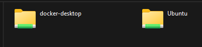

#Docker Desktop 
&nbsp;

- Roda com Hyper-V (Máquina Virtual)
- Precisa de licença PRO
- Exige mais recursos da máquina
- Desempenho bem superior ao Toolbox

#Surge o WSL  - 2016 ( Windows Subsystem for Linux)
Jogar o linux embarcado dentro do linux 
- Acesso a "quase" todos os comandos Linux
- Mas não tem o Kernel completo do Linux
  
 
 #WSL 2 
 - Link : https://docs.docker.com/desktop/wsl/
 - Link : https://github.com/codeedu/wsl2-docker-quickstart

### Fazer backup do wsl2

Copy :
>C:\Users\brend\AppData\Local\Packages\CanonicalGroupLimited.Ubuntu_79rhkp1fndgsc\LocalState\ext4.vhdx
___

### Comandos para configurar o wsl2

Ver a lista de distribuições que tenho instalado do Linux
>wsl --list --verbos

Listar distribuições
>wsl --list --verbose

Definir "Ubuntu-20.04" como padrão
>wsl --set-default Ubuntu-20.04

Verificar se a distribuição padrão foi alterada
>wsl

Entrar no ubuntu
> wsl -d "docker-desktop"

> [!NOTE]
> `docker-desktop` faz o compartilhamento dentro do `Ubuntu` ou outras distribuições **instaladas** na máquina 
>
> 

## Comandos simples para ver os containers, iniciar um novo container

| COMANDOS   | DESCRIÇÃO |
| ------    | ------ |
| `docker ps` |  Quais são os containers rodando|
| `docker run hello-world` |Rodar uma imagem de um container|
| `docker ps -a` | Mostra todos os containers que estão rodando e os que rodaram|
| `docker run -it ubuntu:latest bash` | Rodar uma imagem, cria o container, o comando -i é para attache com o comando bash |
| `docker start <name-container-id>`   | Rodar um container |

## Comandos para rodar o container, porta e acessar o bash

| COMANDOS          | DESCRIÇÃO                          |
| ----------------- | ---------------------------------- |
| `docker run -p`   | Rodar um container expondo portas `-p` **publish** vai redirecionar a porta mapeada para a porta do container |
| `docker rm nginx -f`   | Vou remover um container que está rodando ` -f` é para **forçar** |
| `docker rm nginx -f`   | Vou remover um container que está rodando ` -f` é para **forçar** |
| `docker exec nginx ls`   |  Executa um comando ls dentro do container
| `docker exec -it nginx bash`   |  Modo interativo com o bash no docker |
 
## Bind Mounts : Se o container morre, os arquivos estão ainda dentro do seu computador 
| COMANDOS          | DESCRIÇÃO                          |
| ----------------- | ---------------------------------- |
| `docker run -d --name nginx -p 8080:80 -v ~/Projects/fullcycle2/docker/html/: /usr/share/nginx/html nginx`   | Rodar o comando para criar o volume na raiz do sistema operacional Comando Simples. |
| -v é um comando antigo `--mount type=bind,source="$(pwd)"/`   | É um comando bem antigo |
| `echo $(pwd)`  /home/docker-desktop| É um comando que eu pegue o diretorio, sem ter a necessidade de ficar digitando o caminho  `/home/docker-desktop/Projects/fullcycle2/docker/html` |
| ` docker run -d --name nginx -p 8080:80 --mount type=bind,source="$(pwd)",target=/usr/share/nginx/html`   | comando para usar com o mount |
| `docker run -d --name nginx -p 8080:80 --mount type=bind,source="$(pwd)"/`   | É um comando bem antigo |

<a href="explicacao-sobre-volumes-docker.md">
Diferença entre VOLUMES e BIND AMOUNT 
</a>