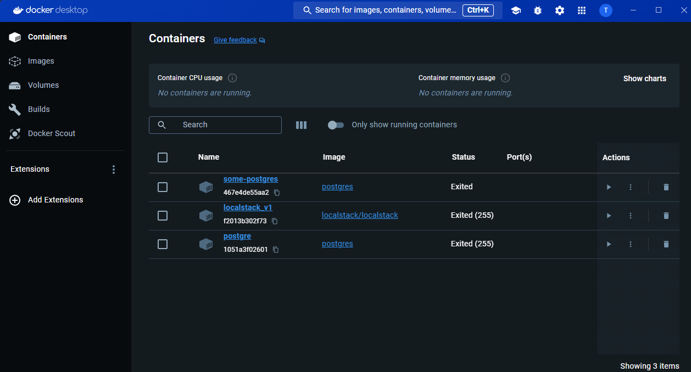
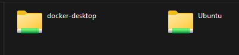

#Docker Desktop 
&nbsp;

- Roda com Hyper-V (Máquina Virtual)
- Precisa de licença PRO
- Exige mais recursos da máquina
- Desempenho bem superior ao Toolbox

#Surge o WSL  - 2016 ( Windows Subsystem for Linux)
Jogar o linux embarcado dentro do linux 
- Acesso a "quase" todos os comandos Linux
- Mas não tem o Kernel completo do Linux
  
 
 #WSL 2 
 - Link : https://docs.docker.com/desktop/wsl/
 - Link : https://github.com/codeedu/wsl2-docker-quickstart

### Fazer backup do wsl2

Copy :
>C:\Users\brend\AppData\Local\Packages\CanonicalGroupLimited.Ubuntu_79rhkp1fndgsc\LocalState\ext4.vhdx
___

### Comandos para configurar o wsl2

Ver a lista de distribuições que tenho instalado do Linux
>wsl --list --verbos

Listar distribuições
>wsl --list --verbose

Definir "Ubuntu-20.04" como padrão
>wsl --set-default Ubuntu-20.04

Verificar se a distribuição padrão foi alterada
>wsl

Entrar no ubuntu
> wsl -d "docker-desktop"

> [!NOTE]
> `docker-desktop` faz o compartilhamento dentro do `Ubuntu` ou outras distribuições **instaladas** na máquina 
>
> 

## Comandos simples para ver os containers, iniciar um novo container

| COMANDOS                            | DESCRIÇÃO                                                                          |
| ----------------------------------- | ---------------------------------------------------------------------------------- |
| `docker ps`                         | Quais são os containers rodando                                                    |
| `docker run hello-world`            | Rodar uma imagem de um container                                                   |
| `docker ps -a`                      | Mostra todos os containers que estão rodando e os que rodaram                      |
| `docker run -it ubuntu:latest bash` | Rodar uma imagem, cria o container, o comando -i é para attache com o comando bash |
| `docker start <name-container-id>`  | Rodar um container                                                                 |

## Comandos para rodar o container, porta e acessar o bash

| COMANDOS                     | DESCRIÇÃO                                                                                                     |
| ---------------------------- | ------------------------------------------------------------------------------------------------------------- |
| `docker run -p`              | Rodar um container expondo portas `-p` **publish** vai redirecionar a porta mapeada para a porta do container |
| `docker rm nginx -f`         | Vou remover um container que está rodando ` -f` é para **forçar**                                             |
| `docker rm nginx -f`         | Vou remover um container que está rodando ` -f` é para **forçar**                                             |
| `docker exec nginx ls`       | Executa um comando ls dentro do container                                                                     |
| `docker exec -it nginx bash` | Modo interativo com o bash no docker                                                                          |
 
## Bind Mounts : Se o container morre, os arquivos estão ainda dentro do seu computador 
| COMANDOS                                                                                                     | DESCRIÇÃO                                                                                                                                            |
| ------------------------------------------------------------------------------------------------------------ | ---------------------------------------------------------------------------------------------------------------------------------------------------- |
| `docker run -d --name nginx -p 8080:80 -v ~/Projects/fullcycle2/docker/html/: /usr/share/nginx/html nginx`   | Rodar o comando para criar o volume na raiz do sistema operacional Comando Simples.                                  |
| -v é um comando antigo `--mount type=bind,source="$(pwd)"/` | É um comando bem antigo                                                                                                                              |
| `echo $(pwd)`  /home/docker-desktop                                                                       | É um comando que eu pegue o diretorio, sem ter a necessidade de ficar digitando o caminho  `/home/docker-desktop/Projects/fullcycle2/docker/html` |
| ` docker run -d --name nginx -p 8080:80 --mount type=bind,source="$(pwd)",target=/usr/share/nginx/html`      | comando para usar com o mount                                                                                                                        |
| `docker run -d --name nginx -p 8080:80 --mount type=bind,source="$(pwd)"/`                                   | É um comando para criar o mount                                                                                                                      |

<a style="text-align:center" href="https://github.com/brendongenssinger/studies-full-cycle/blob/master/docker/explicacao-sobre-volumes-docker.md"><h3 style="color:red;text-align:center">Link => Diferença entre VOLUMES e BIND AMOUNT </h3></a>
  
<h2 style="color:green;text-align:center">Criação de Volumes </h2>

| COMANDOS                                                                             | DESCRIÇÃO                                                        |
| ------------------------------------------------------------------------------------ | ---------------------------------------------------------------- |
| `docker volume create meuvolume`                                                     | É um comando para criar o volume                                 |
| ` docker volume ls`                                                                  | Listo os volumes                                                 |
| `docker volume inspect meuvolume`                                                    | Inspeciono um volume especifico                                  |
| `docker run --name nginx -d --mount type=volume,source=meuvolume,target=/app nginx`  | Rodar um novo container para compartilhar o mesmo volume         |
| `docker run --name nginx2 -d --mount type=volume,source=meuvolume,target=/app nginx` | Rodar um novo container para compartilhar o mesmo volume         |
| `docker exec -it nginx2 bash`                                                        | Entro no bash e tenho a possibilidade de abrir o mesmo diretorio |
| `docker run --name nginx3 -d -v meuvolume:/app nginx`                                | Comando para compartilhar o meuvolume dentro do container        |
| `docker volume prune`                                                                | Vai matar tudo que está dentro do volume                         |

 ## Sobre as imagens
 ### Como criar uma imagem com DockerFile
 É uma receita de bolo !

` FROM: Define a imagem base a ser utilizada.`

`RUN: Executa comandos durante a construção da imagem.`

`COPY: Copia arquivos e diretórios para dentro da imagem.`

`WORKDIR: Define o diretório de trabalho para os comandos seguintes.`

`CMD ou ENTRYPOINT: Define o comando a ser executado quando o contêiner for iniciado.`

`docker ps -a -q ` : Lista apenas os ids dos container
  
`docker rm $(docker ps -a -q) -f` Encerra todos os containers 
## Diferença entre CMD x EntryPoint
<b>O comando e entryPoint segura o comando dentro do docker </b>s

CMD:

Define o comando padrão que será executado no contêiner.
Pode ser substituído por argumentos passados ao docker run.
Exemplo:
Dockerfile
Copy code
> `FROM ubuntu`
> 
> `CMD ["echo", "Hello, World!"]`

###Comandos:
> `docker run myimage`: Executa "echo Hello, World!".
> 
> `docker run myimage Hi there!`: 
Substitui CMD, executa "echo Hi there!".
 
### Publicar a imagem no DOCKER HUB

> `docker push` brendonmascarenhas/nginx-fullcycle

###Tipos de Network DOCKER
Rede internas dentro 

1 - Um container comunicar com outro

###Tipos de network :

|Tipos de redes | Explicação|
|----- |----- |
|----- |----- |
|Bridge (PONTE) | É uma rede privada interna criada pelo Docker no host. Cada contêiner conectado a essa rede pod/var/tmp/assdig.arql1_53.sql assdig.arql1_54.sqle se comunicar com outros contêineres na mesma rede, mas é isolado do tráfego de rede externa por padrão. São isolados dos outros contêineres em outras redes ou no host . É uma boa prática de segurança, evitando interferências entre contêiners. Permite a comunicação entre contêineres usando seus nomes em vez de endereços IP.|
| Host (Network) | Principal motivo de não utilizar, no MACOS este serviço não funciona. O docker foi feito para rodar no linux, juntando a rede do container docker e não com a do MACOS, agora quando está utilizando um Windows, mas com WSL Linux, o cenário muda. ` docker run --rm -d --name nginx-host --network host nginx`
| Do seu container precisa acessar alguma porta ou recurso do docker-host, como que faz ? | |

> docker network create -d bridge network-node
___

### Docker logs 
`docker logs <name-docker>`

`docker logs <name-docker> --follow`

`docker logs <name-docker> --details`

____

### Remove todos os container 
`docker rm $(docker ps -a -q ) -f`
___

### Docker-Compose : 

### Remova containers órfãos `Docker-Compose`
`docker-compose -f docker-compose.node.yaml down --remove-orphans`

### Forçar reconstrução da imagem `Docker-Compose` 
`docker-compose -f docker-compose.node.yaml build --no-cache`

### Subir os container `Docker-Compose`
`docker-compose -f docker-compose.node.yaml up -d`

## > Depends_on 
Não acontece mais na versão 3.0, com a tag `depends_on: - db` não signfica que o docker vai esperar subir o DB para depois subir o NODE.

> Uso do `DOCKERIZE`
>
> 

